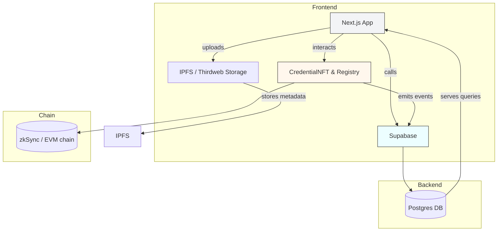
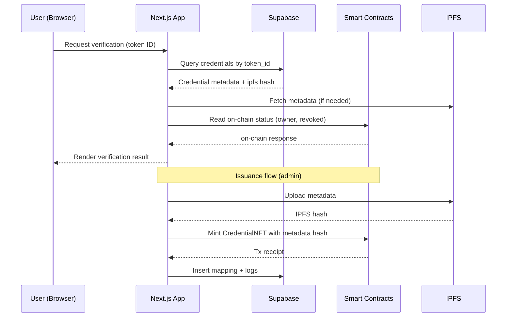

<!--
  Top-level README for the Arcedia / Acredia project (Acredia is the brand)
  Generated by assistant per user request on 2025-11-15.
-->

# Acredia (Project)


**Website Name:** Acredia

---

<!-- Badges (use shields.io) -->


---

## Table of Contents
- [About](#about)
- [Screenshots](#screenshots)
- [Key Features](#key-features)
- [Architecture](#architecture)
- [Technology Stacks](#technology-stacks)
- [Project Structure](#project-structure)
  - [Frontend](#frontend)
  - [Contracts](#contracts)
- [Data Flow](#data-flow)
- [Setup & Installation](#setup--installation)
- [Environment Configuration](#environment-configuration)
- [License](#license)
- [Acknowledgements](#acknowledgements)
- [Team](#team)

---

## About

Acredia is an academic credential issuance and verification platform combining on-chain NFT credentials, IPFS metadata storage, and off-chain records via Supabase. The frontend is a Next.js app with wallet/contract integrations, and the contracts are Solidity smart contracts managed with Hardhat.

## Screenshots

> Add screenshots here (place files under `frontend/public/screenshots/` and reference them below):


*(Remove or replace placeholders with actual images.)*

---

## Key Features
- On-chain Credential NFT issuance and registry
- IPFS metadata storage (Thirdweb / nft.storage fallback)
- Off-chain index & queries via Supabase (Postgres)
- Wallet integrations (thirdweb, ethers.js)
- Instant verification page and QR code based checks
- Admin flows for institutions to issue credentials

---

## Architecture

High-level architecture (Mermaid graph - top-to-bottom):



---

## Technology Stacks

- Frontend: Next.js (App Router), React, TypeScript, Tailwind CSS, Radix UI
- Wallet/Contracts: thirdweb SDK, ethers.js
- Storage: IPFS (Thirdweb storage primary, nft.storage fallback)
- Backend: Supabase (Postgres with RLS)
- Contracts: Solidity (0.8.x), Hardhat (with zkSync plugin configuration present)
- Tooling: pnpm (preferred), Node.js, TypeScript

---

## Features (Detailed)

- Issue credential NFTs (CredentialNFT.sol)
- Register credential metadata on-chain (CredentialRegistry.sol)
- Store and retrieve credential metadata via IPFS
- Maintain off-chain credential indices and verification logs in Supabase
- Institution admin UI to authorize issuers and upload credentials
- Public verify page to check credential validity by token ID or QR scan

---

## Project Structure

Below are the important folders and routes for both the frontend and contracts. This structure reflects the repository snapshot.

**Frontend**

```
frontend/
  public/
    logo.png
    screenshots/
  src/
    app/
      page.tsx                 # Landing
      layout.tsx               # Global metadata + favicon
      about/page.tsx
      verify/page.tsx          # Public verify page
      admin/page.tsx
      auth/                    # auth routes: login, register, admin-setup, admin-login
      dashboard/page.tsx
    components/
      institution/
        AuthorizeIssuer.tsx
        CredentialUploadForm.tsx
        IssuedCredentialsList.tsx
      student/
        CredentialDiagnostic.tsx
        QRCodeModal.tsx
        StudentCredentialsList.tsx
      ui/                      # UI primitives (button, input, card, dialog, etc.)
    contexts/
      AuthContext.tsx
    hooks/
      useAuth.ts
    lib/
      contracts.ts             # contract helpers (issueCredentialNFT, registerCredential...)
      ipfs.ts                  # IPFS upload helpers
      supabase.ts              # Supabase helpers
      thirdweb.ts
      utils.ts
    types/
      index.ts
  package.json
  tsconfig.json
  postcss.config.mjs
```

**Contracts**

```
contracts/
  contracts/
    CredentialNFT.sol
    CredentialRegistry.sol
  scripts/
    verify/my-contract.js
  hardhat.config.js
  package.json
```

---

## Data Flow (Mermaid Sequence Diagram)



---

## Setup & Installation

These steps assume you have Node.js and pnpm installed. Adapt commands to `npm` or `yarn` if preferred.

1. Clone the repo

```powershell
Set-Location -Path "D:\Coding Only\Hackathon\"
git clone <repo-url> Arcedia
Set-Location -Path .\Arcedia\frontend
```

2. Frontend

```powershell
# from repository root
Set-Location -Path .\frontend\
pnpm install
# start dev server
pnpm dev

# if you changed logo or public assets, clear Next cache:
Remove-Item -Recurse -Force .next
pnpm dev
```

3. Contracts (Hardhat)

```powershell
Set-Location -Path ..\contracts\
pnpm install
# compile
pnpx hardhat compile
# run tests
pnpx hardhat test
```

4. Deploying contracts

Configure env variables (see section below) and run your usual Hardhat deploy scripts. If using zkSync, follow the zkSync plugin documentation configured in `hardhat.config.js`.

---

## Environment Configuration

Add a `.env` or set environment variables on your hosting provider. Sensitive keys must never be committed.

Frontend (example `.env.local` in `frontend`):

```
NEXT_PUBLIC_THIRDWEB_CLIENT_ID=your_thirdweb_client_id
NEXT_PUBLIC_CREDENTIAL_NFT_CONTRACT=0x...
NEXT_PUBLIC_CREDENTIAL_REGISTRY_CONTRACT=0x...
NEXT_PUBLIC_SUPABASE_URL=https://xyz.supabase.co
NEXT_PUBLIC_SUPABASE_ANON_KEY=public-anon-key
NEXT_PUBLIC_NFT_STORAGE_KEY=your_nft_storage_key

# Optional
NEXT_PUBLIC_NETWORK=sepolia
```

Contracts (example `.env` in `contracts`):

```
PRIVATE_KEY=0xyourprivatekey
RPC_URL=https://rpc.your-provider
```

Environment notes:
- Keep private keys and admin secrets out of source control.
- For local Supabase or migrations, follow the Supabase CLI or dashboard instructions.

---

## License

This project does not include a license file in the repository by default. Add a `LICENSE` file (MIT, Apache-2.0, etc.) depending on your preference. Example: `MIT`.

---

## Acknowledgements

- Built with Next.js, Tailwind, Hardhat, and Supabase
- Icons from `lucide-react`
- Wallet SDKs and storage helpers inspired by thirdweb examples

---

## Team

**Power Button**

Team members:

1. Souvik Mandal
2. Soumen Das
3. Snigdha Mandal
4. Soumen Mandal

---

If you want, I can also:
- Add a `LICENSE` file (e.g., MIT), and update badges accordingly.
- Replace screenshot placeholders with real images found in `frontend/public/`.
- Generate a smaller `README-frontend.md` inside the `frontend/` folder focused on dev-run details.

---

Last updated: 2025-11-15
# Acredia

**Project overview**

Acredia is a blockchain-backed credential issuance and verification platform. Institutions can issue credential NFTs to students, store credential metadata on IPFS, and record/verify credential entries in an on-chain registry while maintaining searchable records in a Postgres-backed Supabase database.

**Key Goals**
- Issue verifiable credential NFTs
- Store credential metadata on IPFS
- Maintain an on-chain registry for verification
- Provide user-facing Next.js frontend for institutions, students, and verifiers

**Repository layout (important files)**
- `contracts/` : Solidity contracts and deployment tooling
  - `contracts/CredentialNFT.sol`
  - `contracts/CredentialRegistry.sol`
  - `hardhat.config.js` (zksync-enabled config)
- `frontend/` : Next.js application (React + TypeScript)
  - `src/lib/contracts.ts` : thirdweb + contract interaction helpers
  - `src/lib/thirdweb.ts` : thirdweb client and contract address helpers
  - `src/lib/ipfs.ts` : IPFS upload/ download helpers (Thirdweb storage + nft.storage fallback)
  - `src/lib/supabase.ts` : Supabase auth + DB helpers
  - `src/app/` : Next.js app routes and UI components

**Tech stack summary**

- Blockchain & Contracts:
  - `solidity` (v0.8.23) — smart contracts for Credential NFT and registry
  - `hardhat` — development environment (with `@matterlabs/hardhat-zksync-*` plugins)
  - `zksync` tooling — config for zkSync networks (Sepolia / Mainnet endpoints present)
  - `@openzeppelin/contracts` — secure base contracts
  - `thirdweb` tooling in `contracts/package.json` for detecting and deploying contracts

- Frontend:
  - `Next.js` (v16) + React (v19) + TypeScript — application framework
  - `Tailwind CSS` (via PostCSS) — styling
  - `Radix UI` — accessible primitives (avatar, dialog, dropdowns, select, tabs)
  - `lucide-react` — icons
  - `react-hook-form` + `zod` — form handling + validation
  - `thirdweb` & `@thirdweb-dev/storage` — wallet/contract integration and storage client
  - `ethers` — hashing (keccak256) and some EVM helpers
  - `@supabase/supabase-js` — auth and Postgres DB access (used for users, institutions, credentials)
  - `nft.storage` fallback — alternative IPFS upload option
  - `html5-qrcode` & `qrcode` — QR generation and scanning utilities
  - `sonner` / `react-hot-toast` — user notifications/toasts

**High-level architecture & data flow**

1. Institution onboarding
   - Institution signs up via Supabase auth. A record is created in the `institutions` table.
   - Institutions can register a wallet address (on-chain issuer address) in Supabase.

2. Issuing a credential
   - Institution fills out credential metadata in the frontend.
   - Frontend builds metadata JSON and computes a `credentialHash` using `ethers.utils.keccak256` (see `generateCredentialHash` in `src/lib/contracts.ts`).
   - Files/metadata uploaded to IPFS using Thirdweb storage (fallback to `nft.storage` in `src/lib/ipfs.ts`).
   - Frontend calls `issueCredential` on the deployed `CredentialNFT` contract (via `thirdweb` usage in `src/lib/contracts.ts`). That creates an NFT and emits an event with a token ID.
   - After mint, the frontend calls `registerCredential` on the `CredentialRegistry` contract to store a canonical mapping (tokenId ↔ credentialHash ↔ ipfsHash) on-chain.
   - The app persists a record in Supabase `credentials` table with tokenId, ipfs hash, issuer, student, and metadata for fast queries and UI.

3. Verifying a credential
   - Verifier provides a credential hash or tokenId.
   - The frontend calls `verifyCredential` / `getCredentialByTokenId` on-chain (via the registry) to confirm on-chain existence and issuer.
   - Optionally fetch IPFS metadata to show the credential details (via `src/lib/ipfs.ts`).
   - Verification events/logs can be stored to Supabase `verification_logs`.

4. Revocation
   - Issuer calls `revokeCredential` on the NFT contract; app also updates the Supabase `credentials.revoked` flag.

**Contracts & Networks**
- Solidity version: `0.8.23` (see `contracts/hardhat.config.js`).
- Hardhat config includes zkSync plugin and network entries for zkSync Sepolia and Mainnet.
- Contracts depend on `@openzeppelin/contracts` and `@thirdweb-dev/contracts` (see `contracts/package.json`).
- Deployment scripts use `thirdweb` CLI helpers defined in `contracts/package.json` (`npx thirdweb@latest deploy|detect|publish`).

**Important environment variables**
Set these (locally or in your hosting provider) for the frontend and contract interactions:

- `NEXT_PUBLIC_THIRDWEB_CLIENT_ID` — thirdweb client id used by the frontend
- `NEXT_PUBLIC_CREDENTIAL_NFT_CONTRACT` — deployed Credential NFT contract address
- `NEXT_PUBLIC_CREDENTIAL_REGISTRY_CONTRACT` — deployed Credential Registry contract address
- `NEXT_PUBLIC_SUPABASE_URL` — Supabase project URL
- `NEXT_PUBLIC_SUPABASE_ANON_KEY` — Supabase anon/public API key
- `NEXT_PUBLIC_NFT_STORAGE_KEY` — (optional) API key for nft.storage fallback

**Run & deploy (developer quickstart)**

1. Contracts (from `contracts/`)
   - Install deps (if needed):
     - `cd contracts; npm install`
   - Deploy using thirdweb CLI (project uses thirdweb helper commands):
     - `cd contracts; npm run deploy`
   - If you use Hardhat directly for zkSync flows, run the normal hardhat commands and ensure the zksync plugins are configured.

2. Frontend (from `frontend/`)
   - Install dependencies:
     - `cd frontend; npm install`
   - Local dev server:
     - `npm run dev`
   - Build for production:
     - `npm run build`
     - `npm run start`

Note: This repository may be used with `pnpm` in other places (see lock files). Use whichever package manager your team prefers.

**Key files to inspect for logic**
- `frontend/src/lib/contracts.ts` — issuing, registering, revoking and helper functions
- `frontend/src/lib/ipfs.ts` — IPFS upload and download, Thirdweb and nft.storage fallbacks
- `frontend/src/lib/supabase.ts` — all Supabase DB helpers used by the app
- `contracts/contracts/CredentialNFT.sol` and `contracts/contracts/CredentialRegistry.sol` — token and registry logic
- `contracts/hardhat.config.js` — solidity + zkSync configuration

**Architectural diagram (textual)**

Frontend (Next.js + React + Thirdweb) -> Thirdweb SDK / ethers -> Smart Contracts (CredentialNFT, CredentialRegistry) on zkSync
                              \\-> IPFS (Thirdweb Storage / nft.storage)
                              \\-> Supabase (auth + Postgres) for user and credential records

**Notes & recommendations**
- Security: Keep private keys and any server-side secrets out of the frontend. Use server-side signing for sensitive flows where possible.
- Rate limits & gateways: IPFS gateway selection is implemented with fallbacks; expect occasional gateway throttling.
- Tests & verification: Add unit tests for solidity (Hardhat) and integration tests for issuance + registration flows.

