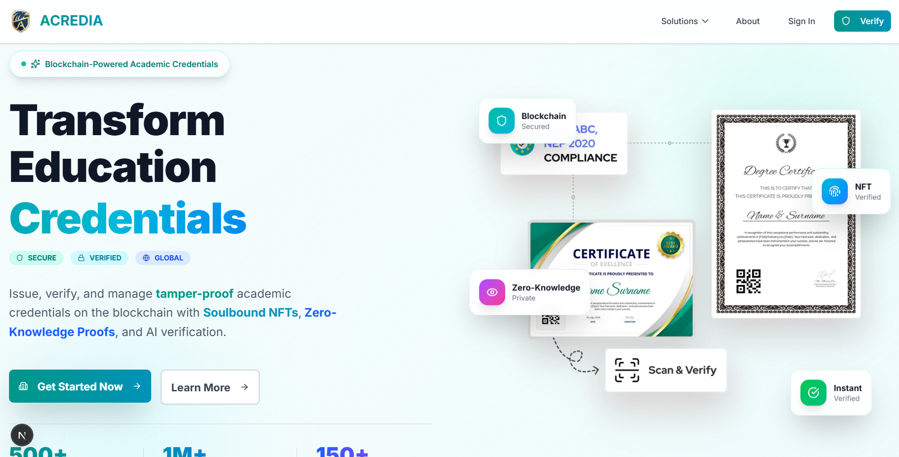
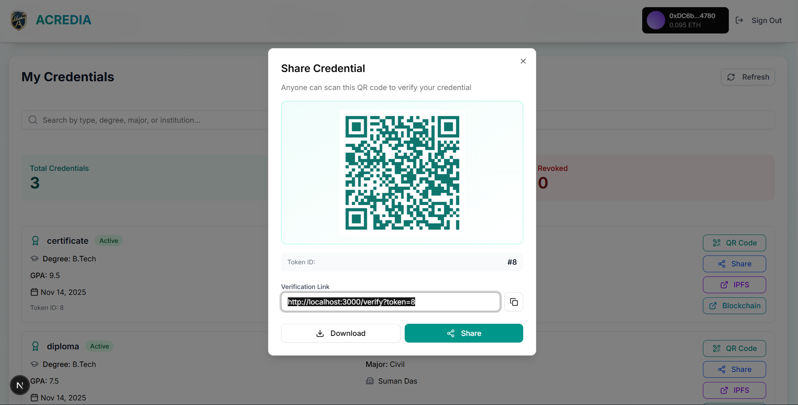
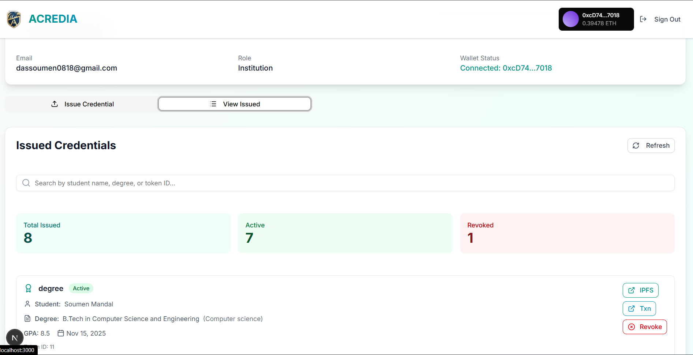
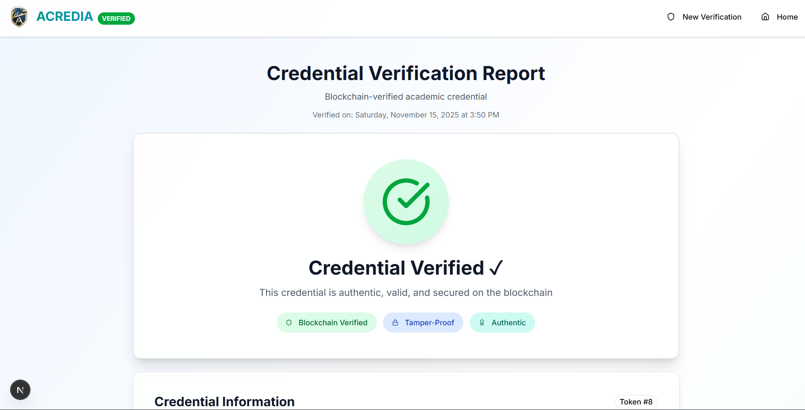
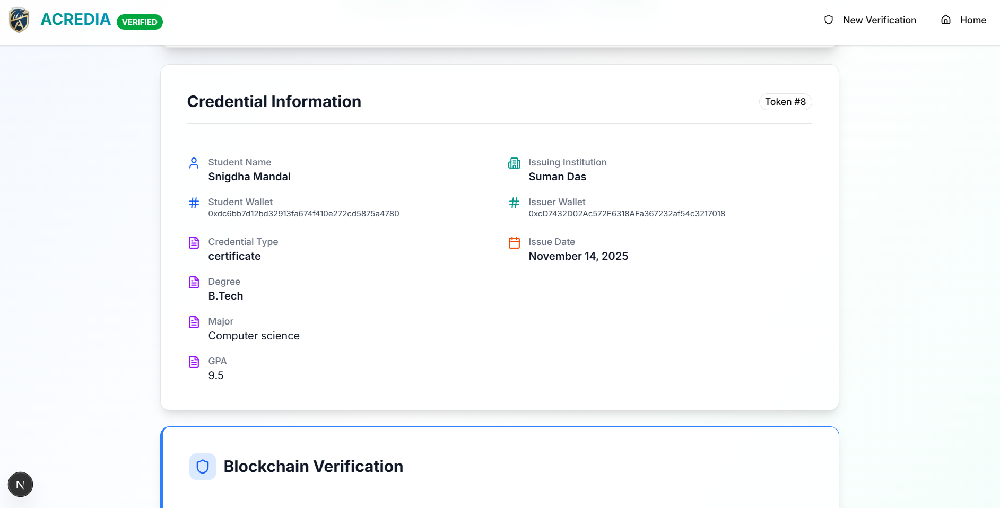
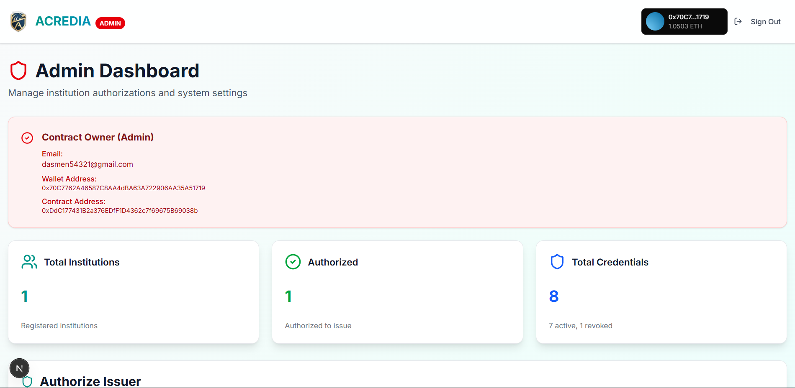
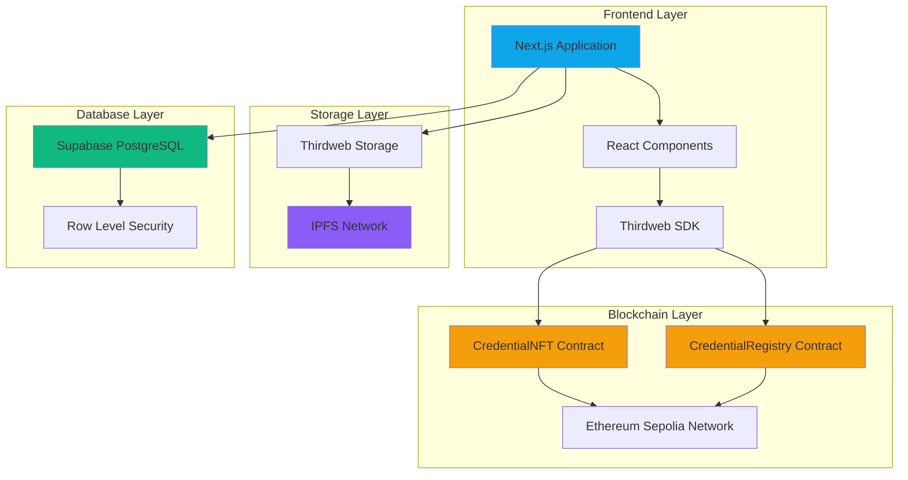
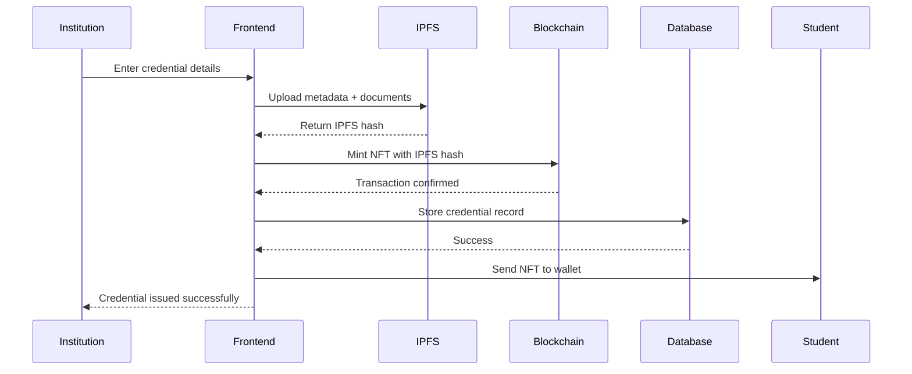
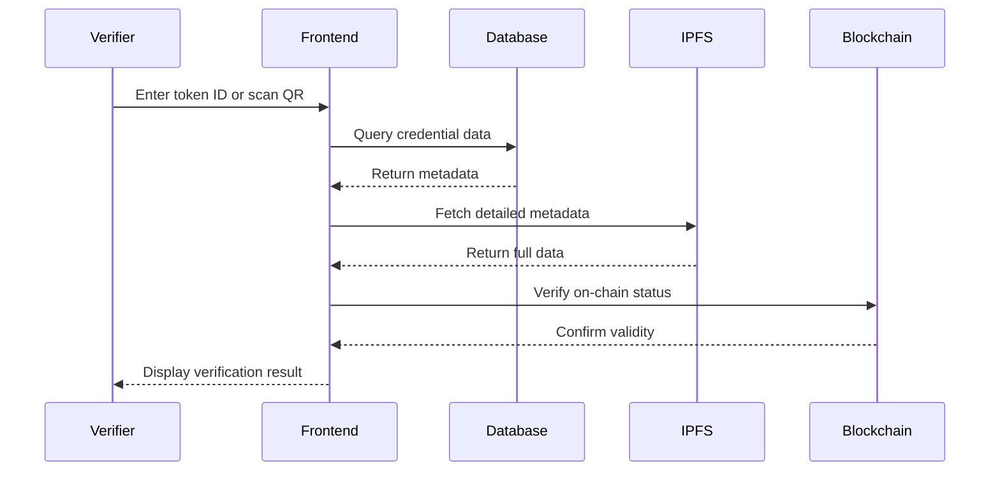

# ACREDIA

<div align="center">
  
  
  ### Blockchain-Based Academic Credential Verification System
  
  *Secure, Transparent, and Tamper-Proof Educational Credentials on the Blockchain*

  
  
  
  
  
</div>

---

## 📑 Table of Contents

- [Overview](#-overview)
- [The Problem](#-the-problem)
- [Our Solution](#-our-solution)
- [Screenshots](#-screenshots)
- [Key Features](#-key-features)
- [Smart Contracts](#-smart-contracts)
- [Technology Stack](#-technology-stack)
- [System Architecture](#-system-architecture)
- [How It Works](#-how-it-works)
- [Getting Started](#-getting-started)
- [Environment Setup](#-environment-setup)
- [Usage Guide](#-usage-guide)
- [Project Structure](#-project-structure)
- [Team](#-team)

---

## 🌟 Overview

**Acredia** is a revolutionary decentralized platform that transforms how academic credentials are issued, stored, and verified. By leveraging blockchain technology, IPFS, and modern web technologies, Acredia eliminates credential fraud, reduces verification time, and provides lifetime access to verified academic records.

### Why Acredia?

Traditional paper-based or centralized digital credentials suffer from:
- Easy forgery and tampering
- Time-consuming verification processes
- Risk of loss or damage
- Limited accessibility
- Centralized control and single points of failure

Acredia solves these problems by creating **immutable, blockchain-verified credentials** that are:
- ✅ Permanent and tamper-proof
- ✅ Instantly verifiable
- ✅ Decentralized and censorship-resistant
- ✅ Accessible anywhere, anytime
- ✅ Privacy-preserving with student control

---

## 🎯 The Problem

The current academic credential system faces critical challenges:

1. **Credential Fraud**: Fake degrees and certificates cost employers billions annually
2. **Slow Verification**: Manual verification takes days or weeks
3. **Institutional Dependency**: Students rely on institutions to provide transcripts
4. **Data Loss**: Physical documents can be lost, damaged, or destroyed
5. **Privacy Concerns**: Sharing full credentials when only partial verification is needed

---

## 💡 Our Solution

Acredia creates a **three-layer verification system**:

1. **Blockchain Layer**: Immutable credential records on Ethereum Sepolia
2. **Storage Layer**: Decentralized metadata storage on IPFS
3. **Database Layer**: Fast querying and indexing via Supabase

This architecture ensures credentials are:
- **Permanent**: Stored on blockchain forever
- **Verifiable**: Instant verification via token ID or QR code
- **Decentralized**: No single point of failure
- **Detailed**: Subject-wise marks, grades, and complete academic records
- **Accessible**: Students own their credentials via NFTs

---

## 📸 Screenshots

### Landing Page


*Modern, responsive landing page showcasing the platform's features*

### Student Dashboard


*Students can view all their credentials with detailed information and blockchain verification*

### Institution Dashboard


*Institutions can issue credentials with subject-wise marks, grades, and complete academic records*

### Credential Verification


*Public verification page with blockchain proof and comprehensive credential details*



*Detailed subject-wise performance and blockchain transaction information*

### Admin Panel


*Contract owner dashboard for authorizing institutions and monitoring system statistics*

---

## ⚡ Key Features

### For Students
- **Digital Wallet**: Receive credentials as NFTs in your wallet
- **Instant Access**: View all credentials anytime, anywhere
- **Easy Sharing**: Generate QR codes or shareable verification links
- **Subject Details**: Access complete subject-wise marks and grades
- **Lifetime Ownership**: Credentials stored permanently on blockchain

### For Institutions
- **Simple Issuance**: Issue credentials with an intuitive web interface
- **Subject-Wise Records**: Add detailed marks, grades, and performance data
- **Batch Processing**: Upload credentials for multiple students
- **Blockchain Verification**: Each credential is verifiable on-chain
- **Authorization Control**: Admin-approved issuer system

### For Verifiers (Employers/Universities)
- **Instant Verification**: Verify credentials in seconds via token ID or QR code
- **Blockchain Proof**: Direct links to blockchain transactions
- **Complete Details**: View student information, institution, marks, and grades
- **No Login Required**: Public verification page accessible to anyone
- **Tamper-Proof**: Impossible to forge or modify credentials

### For Administrators
- **Authorization Management**: Approve institutions to issue credentials
- **System Statistics**: Real-time dashboard with credential counts
- **Contract Ownership**: Full control over smart contract parameters
- **Security**: Only contract owner can authorize new issuers

---

## 📜 Smart Contracts

Acredia uses two main smart contracts deployed on **Ethereum Sepolia Testnet**:

### CredentialNFT Contract
**Address**: `0xDdC177431B2a376EDfF1D4362c7f69675B69038b`

**View on Explorer**: [https://sepolia.etherscan.io/address/0xDdC177431B2a376EDfF1D4362c7f69675B69038b](https://sepolia.etherscan.io/address/0xDdC177431B2a376EDfF1D4362c7f69675B69038b)

**Key Functions**:
- `mintCredential(address to, string memory uri)` - Mint new credential NFT
- `authorizeIssuer(address issuer)` - Authorize institution to issue credentials
- `revokeCredential(uint256 tokenId)` - Revoke a credential if needed
- `authorizedIssuers(address)` - Check if address is authorized

### CredentialRegistry Contract  
**Address**: `0x89A9A004aBaAF80096676829AF6E7D51e6A14111`

**View on Explorer**: [https://sepolia.etherscan.io/address/0x89A9A004aBaAF80096676829AF6E7D51e6A14111](https://sepolia.etherscan.io/address/0x89A9A004aBaAF80096676829AF6E7D51e6A14111)

**Key Functions**:
- `registerCredential(uint256 tokenId, string memory ipfsHash)` - Register credential metadata
- `getCredential(uint256 tokenId)` - Retrieve credential information
- `updateCredentialStatus(uint256 tokenId, bool revoked)` - Update revocation status

> **Note**: These contracts are deployed on Ethereum Sepolia testnet. You can verify their authenticity and view all transactions on Etherscan using the links above.

---

## 🛠 Technology Stack

### Frontend
- **Next.js 16** - React framework with App Router for optimal performance
- **TypeScript** - Type-safe development
- **Tailwind CSS** - Utility-first styling
- **Radix UI** - Accessible component primitives
- **Thirdweb SDK** - Wallet connection and blockchain interactions
- **Lucide React** - Modern icon library

### Blockchain
- **Solidity 0.8.x** - Smart contract language
- **Hardhat** - Development environment
- **Ethereum Sepolia** - Testnet deployment
- **Ethers.js** - Ethereum library
- **OpenZeppelin** - Secure contract libraries

### Storage & Backend
- **IPFS** - Decentralized metadata storage via Thirdweb
- **Supabase** - PostgreSQL database with Row Level Security
- **PostgreSQL** - Relational database for indexing
- **RESTful APIs** - Custom API routes in Next.js

### Development Tools
- **pnpm** - Fast, disk-efficient package manager
- **ESLint** - Code quality
- **Prettier** - Code formatting
- **Git** - Version control

---

## 🏗 System Architecture



### Architecture Layers

1. **Presentation Layer**: User interfaces for students, institutions, and verifiers
2. **Application Layer**: Business logic, authentication, and API routes
3. **Blockchain Layer**: Smart contracts for credential NFTs and registry
4. **Storage Layer**: IPFS for decentralized metadata storage
5. **Database Layer**: Supabase for fast queries and off-chain indexing

---

## 🔄 How It Works

### Credential Issuance Flow



### Verification Flow



### Step-by-Step Process

#### For Institutions (Issuing Credentials)

1. **Connect Wallet**: Institution connects authorized wallet
2. **Enter Student Details**: Name, wallet address, credential type
3. **Add Academic Data**: Degree, major, GPA, issue date
4. **Add Subject Marks**: Subject name, marks obtained, maximum marks, grade
5. **Upload to IPFS**: System uploads metadata to decentralized storage
6. **Mint NFT**: Smart contract mints credential NFT to student's wallet
7. **Database Record**: System creates searchable database entry
8. **Confirmation**: Student receives NFT in their wallet

#### For Students (Viewing Credentials)

1. **Login**: Authenticate with email or wallet
2. **Dashboard**: View all issued credentials
3. **Details**: Click credential to see complete information
4. **Share**: Generate QR code or verification link
5. **Download**: Export credential details or share blockchain proof

#### For Verifiers (Checking Credentials)

1. **Access**: Navigate to public verification page (no login required)
2. **Input**: Enter credential token ID or scan QR code
3. **Verification**: System checks blockchain and IPFS
4. **Results**: View complete credential details with blockchain proof
5. **Confirmation**: Verify authenticity via blockchain explorer link

---

## 🚀 Getting Started

### Prerequisites

Before you begin, ensure you have the following installed:

- **Node.js** (v18 or higher) - [Download](https://nodejs.org/)
- **pnpm** (v8 or higher) - Install via: `npm install -g pnpm`
- **Git** - [Download](https://git-scm.com/)
- **MetaMask** or compatible Web3 wallet - [Install](https://metamask.io/)

### Installation

1. **Clone the Repository**

```powershell
git clone https://github.com/thisisouvik/Arcedia.git
cd Arcedia
```

2. **Install Frontend Dependencies**

```powershell
cd frontend
pnpm install
```

3. **Install Contract Dependencies**

```powershell
cd ../contracts
pnpm install
```

### Configuration

4. **Set Up Environment Variables**

Create a `.env.local` file in the `frontend` directory:

```env
# Thirdweb Configuration
NEXT_PUBLIC_THIRDWEB_CLIENT_ID=your_thirdweb_client_id

# Smart Contract Addresses (Ethereum Sepolia)
NEXT_PUBLIC_CREDENTIAL_NFT_CONTRACT=0x_your_nft_contract_address
NEXT_PUBLIC_CREDENTIAL_REGISTRY_CONTRACT=0x_your_registry_contract_address

# Supabase Configuration
NEXT_PUBLIC_SUPABASE_URL=https://your-project.supabase.co
NEXT_PUBLIC_SUPABASE_ANON_KEY=your_supabase_anon_key

# IPFS Storage (Optional - for fallback)
NEXT_PUBLIC_NFT_STORAGE_KEY=your_nft_storage_key
```

Create a `.env` file in the `contracts` directory:

```env
# Wallet Private Key (for deployment)
PRIVATE_KEY=your_wallet_private_key

# RPC URL
SEPOLIA_RPC_URL=https://eth-sepolia.g.alchemy.com/v2/your_api_key
```

### Database Setup

5. **Set Up Supabase Database**

Run the following SQL scripts in your Supabase SQL Editor:

```sql
-- Run these in order:
1. frontend/database_schema.sql
2. frontend/FIX_DATABASE_RLS.sql
3. frontend/enable_public_verification.sql
4. frontend/enable_admin_stats.sql
```

### Smart Contract Deployment

6. **Compile and Deploy Contracts**

```powershell
cd contracts
pnpm hardhat compile
pnpm hardhat run scripts/deploy.js --network sepolia
```

7. **Verify Contracts on Etherscan**

```powershell
pnpm hardhat verify --network sepolia YOUR_CONTRACT_ADDRESS
```

### Running the Application

8. **Start the Development Server**

```powershell
cd frontend
pnpm dev
```

9. **Open in Browser**

Navigate to [http://localhost:3000](http://localhost:3000)

### Production Build

```powershell
cd frontend
pnpm build
pnpm start
```

---

## ⚙️ Environment Setup

### Getting API Keys

#### Thirdweb Client ID
1. Visit [Thirdweb Dashboard](https://thirdweb.com/dashboard)
2. Create a new project
3. Copy your Client ID

#### Supabase Setup
1. Create account at [Supabase](https://supabase.com)
2. Create a new project
3. Get your project URL and anon key from Settings > API
4. Run the provided SQL scripts in SQL Editor

#### Alchemy RPC (for Sepolia)
1. Sign up at [Alchemy](https://www.alchemy.com/)
2. Create a new app on Ethereum Sepolia
3. Copy the HTTPS endpoint

#### NFT.Storage (Optional)
1. Visit [NFT.Storage](https://nft.storage/)
2. Create account and generate API token
3. Used as fallback IPFS storage

### Wallet Setup

1. Install MetaMask browser extension
2. Create or import wallet
3. Switch to Sepolia Test Network
4. Get test ETH from [Sepolia Faucet](https://sepoliafaucet.com/)

---

## 📖 Usage Guide

### For Administrators

**Authorizing Institutions**

1. Connect the contract owner wallet
2. Navigate to Admin Dashboard
3. Enter institution wallet address
4. Click "Authorize Wallet"
5. Confirm blockchain transaction
6. Institution can now issue credentials

### For Institutions

**Issuing a Credential**

1. Login with authorized institution account
2. Go to Dashboard > Issue Credential tab
3. Fill in student details:
   - Student Name
   - Student Wallet Address
   - Credential Type (Degree, Certificate, etc.)
   - Degree/Major/GPA
   - Issue Date
4. Add subjects (click "+ Add Subject"):
   - Subject Name
   - Marks Obtained
   - Maximum Marks
   - Grade (optional)
5. Click "Issue Credential"
6. Confirm wallet transaction
7. Wait for confirmation
8. Student receives NFT in their wallet

**Viewing Issued Credentials**

1. Go to Dashboard > Issued Credentials tab
2. View all credentials issued by your institution
3. See blockchain transaction hashes
4. Access IPFS metadata links

### For Students

**Viewing Your Credentials**

1. Login with student account
2. Dashboard displays all your credentials
3. Click on any credential to see:
   - Institution details
   - Credential type and dates
   - Subject-wise marks and grades
   - Overall performance statistics
   - Blockchain verification proof

**Sharing Credentials**

1. Click "Share" on any credential
2. Options:
   - Generate QR Code
   - Copy verification link
   - Share token ID
3. Recipients can verify without login

### For Verifiers (Employers/Universities)

**Verifying Credentials**

1. Go to verification page (no login required)
2. Enter credential token ID OR scan QR code
3. View complete credential details:
   - Student information
   - Issuing institution
   - Academic records
   - Subject-wise performance
   - Blockchain proof
4. Click blockchain link to verify on Etherscan
5. Confirm credential is authentic and not revoked

---

## 📁 Project Structure

### Frontend Directory Structure

```
frontend/
├── public/
│   ├── logo.png                    # Acredia logo
│   ├── Acredia.png                 # Brand assets
│   └── screenshots/                # UI screenshots
├── src/
│   ├── app/
│   │   ├── page.tsx               # Landing page
│   │   ├── layout.tsx             # Root layout with providers
│   │   ├── globals.css            # Global styles
│   │   ├── about/
│   │   │   └── page.tsx           # About page
│   │   ├── admin/
│   │   │   └── page.tsx           # Admin dashboard
│   │   ├── api/
│   │   │   └── admin/
│   │   │       ├── stats/route.ts          # Statistics API
│   │   │       └── update-authorization/   # Authorization sync
│   │   ├── auth/
│   │   │   ├── login/             # Student/Institution login
│   │   │   ├── register/          # User registration
│   │   │   ├── admin-login/       # Admin authentication
│   │   │   └── admin-setup/       # Initial admin setup
│   │   ├── dashboard/
│   │   │   └── page.tsx           # User dashboard
│   │   └── verify/
│   │       └── page.tsx           # Public verification page
│   ├── components/
│   │   ├── institution/
│   │   │   ├── AuthorizeIssuer.tsx           # Authorization UI
│   │   │   ├── CredentialUploadForm.tsx      # Issuance form
│   │   │   └── IssuedCredentialsList.tsx     # Issued credentials
│   │   ├── student/
│   │   │   ├── StudentCredentialsList.tsx    # Student's credentials
│   │   │   ├── QRCodeModal.tsx              # QR code display
│   │   │   └── CredentialDiagnostic.tsx     # Debug component
│   │   ├── verification/
│   │   │   └── (verification components)
│   │   ├── shared/
│   │   │   └── (shared components)
│   │   └── ui/
│   │       ├── button.tsx         # Button component
│   │       ├── card.tsx           # Card component
│   │       ├── input.tsx          # Input component
│   │       ├── form.tsx           # Form components
│   │       └── (other UI primitives)
│   ├── contexts/
│   │   └── AuthContext.tsx        # Authentication context
│   ├── hooks/
│   │   └── useAuth.ts             # Authentication hook
│   ├── lib/
│   │   ├── contracts.ts           # Smart contract interactions
│   │   ├── credentialService.ts   # Credential issuance service
│   │   ├── ipfs.ts                # IPFS upload utilities
│   │   ├── supabase.ts            # Supabase client
│   │   ├── thirdweb.ts            # Thirdweb configuration
│   │   └── utils.ts               # Utility functions
│   └── types/
│       └── index.ts               # TypeScript type definitions
├── package.json                    # Dependencies
├── tsconfig.json                   # TypeScript config
├── next.config.ts                  # Next.js configuration
├── tailwind.config.js              # Tailwind CSS config
├── postcss.config.mjs              # PostCSS config
└── components.json                 # Shadcn UI config
```

### Contracts Directory Structure

```
contracts/
├── contracts/
│   ├── CredentialNFT.sol          # ERC721 NFT contract
│   └── CredentialRegistry.sol     # Credential registry
├── scripts/
│   ├── deploy.js                  # Deployment script
│   └── verify/
│       └── my-contract.js         # Verification script
├── test/
│   └── (test files)
├── artifacts-zk/                   # Compiled artifacts
├── cache-zk/                       # Build cache
├── hardhat.config.js              # Hardhat configuration
└── package.json                    # Dependencies
```

### Database Schema (Supabase)

```
credentials
├── id (uuid)
├── token_id (bigint) - NFT token ID
├── student_id (uuid) - Reference to students
├── institution_id (uuid) - Reference to institutions
├── ipfs_hash (text) - IPFS metadata hash
├── blockchain_hash (text) - Transaction hash
├── metadata (jsonb) - Credential details
├── issued_at (timestamp)
├── revoked (boolean)
├── revoked_at (timestamp)
├── student_wallet_address (text)
└── issuer_wallet_address (text)

students
├── id (uuid)
├── email (text)
├── name (text)
├── wallet_address (text)
└── created_at (timestamp)

institutions
├── id (uuid)
├── email (text)
├── name (text)
├── wallet_address (text)
├── verified (boolean)
└── created_at (timestamp)

verification_logs
├── id (uuid)
├── credential_id (uuid)
├── verified_at (timestamp)
└── verification_result (jsonb)
```

---

## 🔐 Security Features

### Smart Contract Security
- **OpenZeppelin Libraries**: Battle-tested contract implementations
- **Access Control**: Only authorized issuers can mint credentials
- **Ownable Pattern**: Contract owner controls authorization
- **Reentrancy Protection**: Guards against reentrancy attacks

### Application Security
- **Row Level Security (RLS)**: Supabase database policies
- **Wallet Authentication**: Cryptographic signature verification
- **Environment Variables**: Sensitive data never committed
- **HTTPS Only**: All production traffic encrypted
- **Public Verification**: No authentication required for verification

### Data Privacy
- **Student Control**: Students own their credential NFTs
- **Selective Disclosure**: Share only what's necessary
- **IPFS Storage**: Decentralized, censorship-resistant
- **No PII on Blockchain**: Personal data only in IPFS/database

---

## 🎨 Design Philosophy

Acredia follows modern web design principles:

- **Responsive**: Works on desktop, tablet, and mobile
- **Accessible**: WCAG 2.1 compliant components
- **Consistent**: Unified design system with Tailwind CSS
- **Intuitive**: Clear user flows and interactions
- **Professional**: Gradient accents and modern aesthetics
- **Fast**: Optimized with Next.js App Router

---

## 🧪 Testing

### Running Tests

```powershell
# Contract tests
cd contracts
pnpm test

# Frontend tests (if configured)
cd frontend
pnpm test
```

### Manual Testing Checklist

**Credential Issuance**
- [ ] Institution can issue credential
- [ ] Student receives NFT
- [ ] Metadata uploaded to IPFS
- [ ] Database record created
- [ ] Subject-wise marks displayed correctly

**Verification**
- [ ] Public verification page loads
- [ ] Token ID search works
- [ ] QR code scanning works
- [ ] Blockchain link redirects correctly
- [ ] Subject table displays properly

**Authorization**
- [ ] Admin can authorize institutions
- [ ] Unauthorized wallets cannot issue
- [ ] Authorization status updates in database

---

## 🚧 Roadmap

### Phase 1: Core Features ✅
- [x] Smart contract development
- [x] NFT credential issuance
- [x] IPFS metadata storage
- [x] Public verification page
- [x] Subject-wise marks system

### Phase 2: Enhanced Features 🚧
- [ ] Bulk credential issuance
- [ ] Advanced filtering and search
- [ ] Email notifications
- [ ] PDF certificate generation
- [ ] Multi-chain support

### Phase 3: Advanced Features 📋
- [ ] Credential revocation UI
- [ ] Decentralized identity (DID) integration
- [ ] Mobile application
- [ ] API for third-party integrations
- [ ] Analytics dashboard

### Phase 4: Enterprise Features 🔮
- [ ] Institutional dashboards
- [ ] Batch operations
- [ ] Advanced reporting
- [ ] White-label solutions
- [ ] Compliance tools

---

## 🐛 Troubleshooting

### Common Issues

**Problem: MetaMask not connecting**
- Solution: Ensure you're on Sepolia network and site permissions are granted

**Problem: Transaction failing**
- Solution: Check you have enough test ETH and wallet is authorized

**Problem: IPFS upload timeout**
- Solution: Check internet connection or try again later

**Problem: Verification page shows "not found"**
- Solution: Ensure RLS policies are enabled in Supabase (run SQL scripts)

**Problem: Subjects not displaying**
- Solution: Clear browser cache and ensure IPFS metadata contains subjects array

### Getting Help

- Check `frontend/docs/TROUBLESHOOTING.md` for detailed solutions
- Review console logs for error messages
- Verify all environment variables are set correctly
- Ensure Supabase migrations are applied

---

## 📄 License

This project is currently **unlicensed**. All rights reserved to the Power Button team.

For licensing inquiries, please contact the team.

---

## 🙏 Acknowledgements

Built with amazing open-source technologies:

- [Next.js](https://nextjs.org/) - React framework
- [Thirdweb](https://thirdweb.com/) - Web3 development platform
- [Supabase](https://supabase.com/) - Open-source Firebase alternative
- [Hardhat](https://hardhat.org/) - Ethereum development environment
- [OpenZeppelin](https://openzeppelin.com/) - Secure smart contract library
- [Tailwind CSS](https://tailwindcss.com/) - Utility-first CSS framework
- [Radix UI](https://www.radix-ui.com/) - Accessible component primitives
- [Lucide Icons](https://lucide.dev/) - Beautiful icon library

Special thanks to the blockchain and open-source community for making this project possible.

---

## 👥 Team

**Power Button**

<table>
  <tr>
    <td align="center">
      <br />
      <sub><b>Souvik Mandal</b></sub><br />
      <a href="https://github.com/thisisouvik">GitHub</a>
    </td>
    <td align="center">
      <br />
      <sub><b>Soumen Das</b></sub><br />
      Blockchain Developer
    </td>
    <td align="center">
      <br />
      <sub><b>Snigdha Mandal</b></sub><br />
      Frontend Developer
    </td>
    <td align="center">
      <br />
      <sub><b>Soumen Mandal</b></sub><br />
      Full Stack Developer
    </td>
  </tr>
</table>

### Connect With Us

- **GitHub**: [https://github.com/thisisouvik/Arcedia](https://github.com/thisisouvik/Arcedia)
- **Project**: Acredia - Blockchain Academic Credentials
- **Status**: Active Development

---

## 📞 Contact & Support

For questions, feedback, or support:

- Open an issue on [GitHub Issues](https://github.com/thisisouvik/Arcedia/issues)
- Review documentation in `frontend/docs/`
- Check existing issues for solutions

---

<div align="center">
  
### Built with ❤️ by Team Power Button

**Making Academic Credentials Secure, Transparent, and Accessible**

⭐ Star this repo if you find it helpful!

</div>