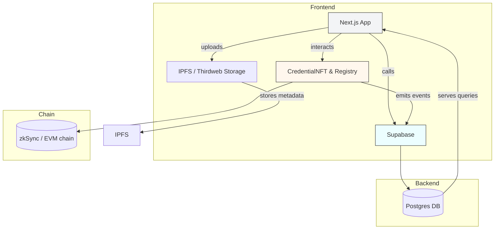
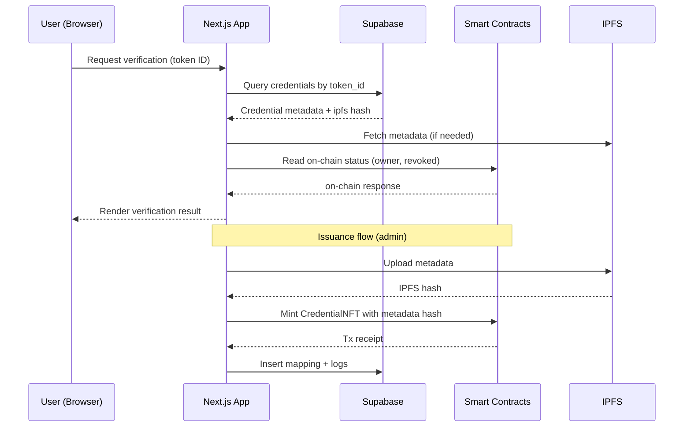

# Acredia - A blockchain-based Academic Credential System

<p align="center"></p>

---

<!-- Badges (use shields.io) -->


---

## Table of Contents
- [About](#about)
- [Screenshots](#screenshots)
- [Key Features](#key-features)
- [Architecture](#architecture)
- [Technology Stacks](#technology-stacks)
- [Project Structure](#project-structure)
  - [Frontend](#frontend)
  - [Contracts](#contracts)
- [Data Flow](#data-flow)
- [Setup & Installation](#setup--installation)
- [Environment Configuration](#environment-configuration)
- [License](#license)
- [Acknowledgements](#acknowledgements)
- [Team](#team)

---

## About

Acredia is an academic credential issuance and verification platform combining on-chain NFT credentials, IPFS metadata storage, and off-chain records via Supabase. The frontend is a Next.js app with wallet/contract integrations, and the contracts are Solidity smart contracts managed with Hardhat.

## Screenshots


---

## Key Features
- On-chain Credential NFT issuance and registry
- IPFS metadata storage (Thirdweb / nft.storage fallback)
- Off-chain index & queries via Supabase (Postgres)
- Wallet integrations (thirdweb, ethers.js)
- Instant verification page and QR code based checks
- Admin flows for institutions to issue credentials

---

## Architecture



---

## Technology Stacks

- Frontend: Next.js (App Router), React, TypeScript, Tailwind CSS, Radix UI
- Wallet/Contracts: thirdweb SDK, ethers.js
- Storage: IPFS (Thirdweb storage primary, nft.storage fallback)
- Backend: Supabase (Postgres with RLS)
- Contracts: Solidity (0.8.x), Hardhat (with zkSync plugin configuration present)
- Tooling: pnpm (preferred), Node.js, TypeScript

---

## Features

- Issue credential NFTs (CredentialNFT.sol)
- Register credential metadata on-chain (CredentialRegistry.sol)
- Store and retrieve credential metadata via IPFS
- Maintain off-chain credential indices and verification logs in Supabase
- Institution admin UI to authorize issuers and upload credentials
- Public verify page to check credential validity by token ID or QR scan

---

## Project Structure

**Frontend**

```
frontend/
  public/
    logo.png
    screenshots/
  src/
    app/
      page.tsx                 # Landing
      layout.tsx               # Global metadata + favicon
      about/page.tsx
      verify/page.tsx          # Public verify page
      admin/page.tsx
      auth/                    # auth routes: login, register, admin-setup, admin-login
      dashboard/page.tsx
    components/
      institution/
        AuthorizeIssuer.tsx
        CredentialUploadForm.tsx
        IssuedCredentialsList.tsx
      student/
        CredentialDiagnostic.tsx
        QRCodeModal.tsx
        StudentCredentialsList.tsx
      ui/                      # UI primitives (button, input, card, dialog, etc.)
    contexts/
      AuthContext.tsx
    hooks/
      useAuth.ts
    lib/
      contracts.ts             # contract helpers (issueCredentialNFT, registerCredential...)
      ipfs.ts                  # IPFS upload helpers
      supabase.ts              # Supabase helpers
      thirdweb.ts
      utils.ts
    types/
      index.ts
  package.json
  tsconfig.json
  postcss.config.mjs
```

**Contracts**

```
contracts/
  contracts/
    CredentialNFT.sol
    CredentialRegistry.sol
  scripts/
    verify/my-contract.js
  hardhat.config.js
  package.json
```

---

## Data Flow



---

## Setup & Installation

These steps assume you have Node.js and pnpm installed. Adapt commands to `npm` or `yarn` if preferred.

1. Clone the repo

```powershell
Set-Location -Path 
git clone <repo-url> Arcedia
Set-Location -Path .\Arcedia\frontend
```

2. Frontend

```powershell
# from repository root
Set-Location -Path .\frontend\
pnpm install
# start dev server
pnpm dev

# if you changed logo or public assets, clear Next cache:
Remove-Item -Recurse -Force .next
pnpm dev
```

3. Contracts (Hardhat)

```powershell
Set-Location -Path ..\contracts\
pnpm install
# compile
pnpx hardhat compile
# run tests
pnpx hardhat test
```

4. Deploying contracts

Configure env variables (see section below) and run your usual Hardhat deploy scripts. If using zkSync, follow the zkSync plugin documentation configured in `hardhat.config.js`.

---

## Environment Configuration

Add a `.env` or set environment variables on your hosting provider. Sensitive keys must never be committed.

Frontend (example `.env.local` in `frontend`):

```
NEXT_PUBLIC_THIRDWEB_CLIENT_ID=your_thirdweb_client_id
NEXT_PUBLIC_CREDENTIAL_NFT_CONTRACT=0x...
NEXT_PUBLIC_CREDENTIAL_REGISTRY_CONTRACT=0x...
NEXT_PUBLIC_SUPABASE_URL=https://xyz.supabase.co
NEXT_PUBLIC_SUPABASE_ANON_KEY=public-anon-key
NEXT_PUBLIC_NFT_STORAGE_KEY=your_nft_storage_key

```

Contracts (example `.env` in `contracts`):

```
PRIVATE_KEY=0xyourprivatekey
RPC_URL=https://rpc.your-provider
```

Environment notes:
- Keep private keys and admin secrets out of source control.
- For local Supabase or migrations, follow the Supabase CLI or dashboard instructions.

---

## License

This project does not include a license file in the repository by default. Add a `LICENSE` file (MIT, Apache-2.0, etc.) depending on your preference. Example: `MIT`.

---

## Acknowledgements

- Built with Next.js, Tailwind, Hardhat, and Supabase
- Icons from `lucide-react`
- Wallet SDKs and storage helpers inspired by thirdweb examples

---

## Team

**Power Button**

Team members:

1. Souvik Mandal
2. Soumen Das
3. Snigdha Mandal
4. Soumen Mandal

---